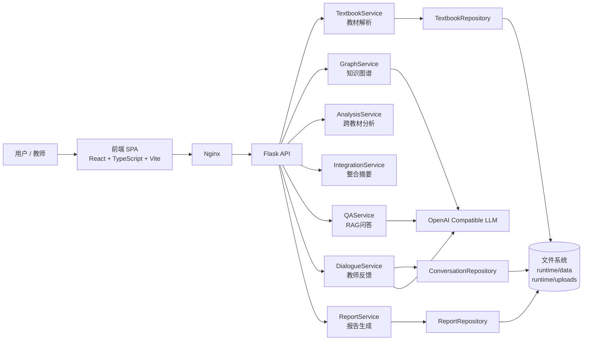
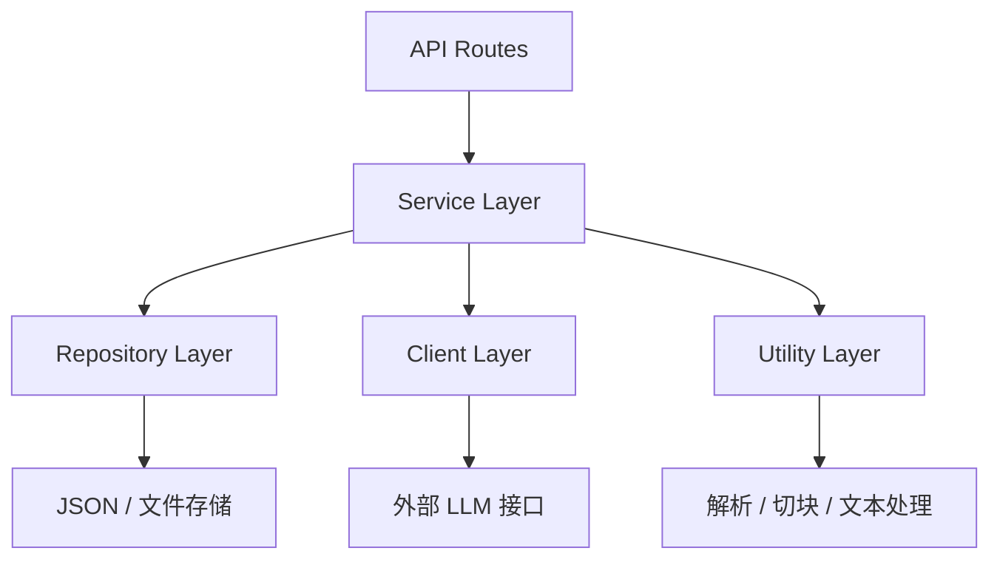
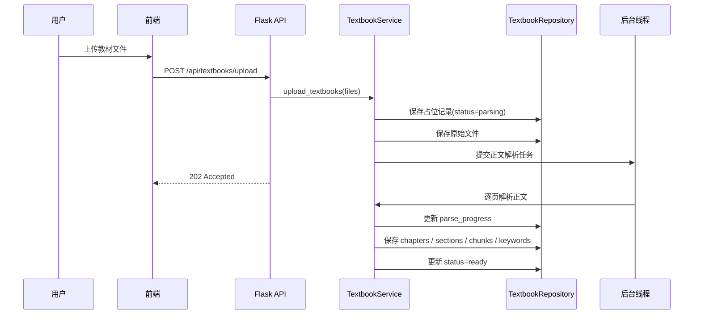
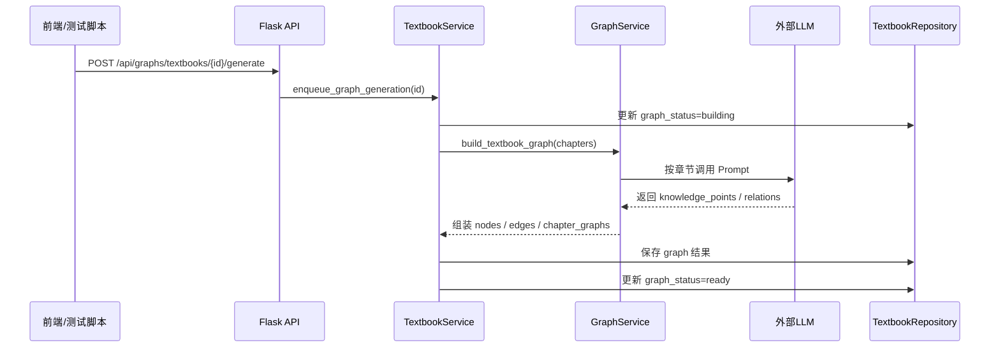

# 系统设计

## 1. 系统架构图

### 1.1 总体架构

当前系统采用前后端分离架构，前端负责交互与可视化，后端负责教材解析、知识图谱、摘要、问答与报告生成。

### 1.2 后端分层结构

---

## 2. 数据流

### 2.1 教材上传与正文解析流

### 2.2 知识图谱生成流

### 2.3 RAG 问答流

1. 用户输入问题
2. 后端读取教材 `chunks`
3. 基于 `TF-IDF + cosine similarity` 执行检索
4. 返回高相关原文片段
5. 若启用 LLM，则基于引用片段生成带编号答案
6. 若未启用，则返回抽取式回答

### 2.4 跨教材分析流

1. 用户选择多本已解析教材
2. `AnalysisService` 汇总关键词
3. 计算共享主题、差异主题、缺失主题
4. 若所有教材都已生成图谱，则优先返回合并后的知识点图谱
5. 否则回退为关键词级组合图谱

### 2.5 整合摘要与报告流

1. `IntegrationService` 从教材小节中切句
2. 按词频和长度惩罚计算句子重要性
3. 在目标压缩预算内选句
4. 最终按原顺序回排，生成带来源摘要
5. `ReportService` 汇总教材、分析、摘要与教师反馈，输出 Markdown 报告

---

## 3. 各层技术选型及理由

### 3.1 前端层

#### 技术选型

- React 18
- TypeScript
- Vite
- Cytoscape.js
- CSS 原生样式

#### 选型理由

1. **React**
   - 适合单页应用和组件化开发
   - 当前页面分为教材管理、图谱区、功能面板三块，天然适合组件拆分

2. **TypeScript**
   - 当前前后端字段较多，如 `graph_status`、`parse_progress`、`parsed_output`
   - 使用静态类型有助于减少接口联调错误

3. **Vite**
   - 构建速度快
   - 配置简单，适合比赛项目迭代

4. **Cytoscape.js**
   - 直接支持缩放、拖拽、节点点击
   - 适合实现交互式知识图谱，而不是静态图片
   - 能表达节点频次、教材来源和关系边

### 3.2 API 层

#### 技术选型

- Flask
- Flask-Cors

#### 选型理由

1. **Flask**
   - 轻量、结构清晰
   - 足够支撑当前 RESTful API 需求
   - 便于把 Service 层能力直接暴露为比赛演示接口

2. **Flask-Cors**
   - 解决本地前后端分离开发和 Docker 部署时的跨域访问问题

### 3.3 业务逻辑层

#### 技术选型

- Service 分层
- `ThreadPoolExecutor`

#### 选型理由

1. **Service 分层**
   - 把教材解析、图谱生成、分析、摘要、问答、报告拆开，职责清晰
   - 对应逻辑 Agent 角色，便于文档表达和后续扩展

2. **ThreadPoolExecutor**
   - 教材解析和图谱生成都属于耗时任务
   - 使用后台线程可以避免上传接口长时间阻塞
   - 当前项目规模下比引入 Celery / 消息队列更轻量

### 3.4 数据访问层

#### 技术选型

- 文件系统
- JSON 持久化

#### 选型理由

1. 当前数据结构相对简单：
   - 教材详情
   - 对话记录
   - 报告记录
2. 文件系统便于直接查看中间结果
3. 不需要额外数据库依赖，部署更轻

### 3.5 文件解析与文本处理层

#### 技术选型

- `pypdf`
- `python-docx`
- `jieba`
- 正则规则解析

#### 选型理由

1. **pypdf**
   - 支持 PDF 逐页提取文本
   - 满足“大文件逐页解析”的需求

2. **python-docx**
   - 用于解析 Word 教材

3. **jieba**
   - 用于中文分词
   - 支撑关键词抽取、摘要打分和 TF-IDF 检索

4. **正则规则**
   - 用于章节标题识别、页码过滤、表格行跳过
   - 工程上实现简单、可控

### 3.6 检索问答层

#### 技术选型

- scikit-learn
- TF-IDF
- cosine similarity

#### 选型理由

1. 本地即可运行
2. 不依赖向量数据库
3. 对教材类长文本已具备基本可用性
4. 便于解释“为什么命中该片段”

### 3.7 大模型调用层

#### 技术选型

- OpenAI 兼容接口
- `requests`
- 外部 Prompt 文件

#### 选型理由

1. 当前代码通过兼容 OpenAI Chat Completions 的方式调用外部模型
2. 模型接入灵活，可替换不同供应商
3. Prompt 独立到 `config/prompt.md`，便于持续优化知识图谱抽取策略

### 3.8 部署层

#### 技术选型

- Docker
- Docker Compose
- Gunicorn
- Nginx

#### 选型理由

1. **Docker / Compose**
   - 统一前后端运行环境
   - 适合比赛交付和演示

2. **Gunicorn**
   - 用于后端生产方式运行 Flask

3. **Nginx**
   - 托管前端静态资源
   - 反向代理后端接口
   - 控制上传大小和超时时间

---

## 4. API 接口一览

当前后端基地址为：`/api`

### 4.1 系统接口

| 方法 | 路径 | 说明 |
|---|---|---|
| `GET` | `/health` | 健康检查 |

### 4.2 教材接口

| 方法 | 路径 | 说明 |
|---|---|---|
| `GET` | `/textbooks` | 获取教材列表 |
| `POST` | `/textbooks/upload` | 上传教材并异步解析 |
| `GET` | `/textbooks/{textbook_id}` | 获取教材完整详情 |
| `GET` | `/textbooks/{textbook_id}/status` | 获取正文解析状态 |
| `GET` | `/textbooks/{textbook_id}/summary` | 获取教材摘要预览 |

### 4.3 图谱接口

| 方法 | 路径 | 说明 |
|---|---|---|
| `GET` | `/graphs/textbooks/{textbook_id}` | 获取单教材图谱 |
| `GET` | `/graphs/textbooks/{textbook_id}/status` | 获取图谱生成状态 |
| `POST` | `/graphs/textbooks/{textbook_id}/generate` | 触发单教材图谱生成 |
| `POST` | `/graphs/combined` | 获取多教材组合图谱 |

### 4.4 分析与摘要接口

| 方法 | 路径 | 说明 |
|---|---|---|
| `POST` | `/analysis/compare` | 执行跨教材分析 |
| `POST` | `/integration/generate` | 生成整合摘要 |

### 4.5 RAG 问答接口

| 方法 | 路径 | 说明 |
|---|---|---|
| `POST` | `/qa/ask` | 提交问题并返回引用式回答 |

### 4.6 教师反馈接口

| 方法 | 路径 | 说明 |
|---|---|---|
| `GET` | `/dialogue/history` | 获取历史反馈记录 |
| `POST` | `/dialogue/message` | 提交教师反馈并生成回复 |

### 4.7 报告接口

| 方法 | 路径 | 说明 |
|---|---|---|
| `GET` | `/reports` | 获取报告列表 |
| `POST` | `/reports/generate` | 生成分析报告 |

---

## 5. 系统设计结论

当前系统设计的核心特点是：

1. **分层清晰**  
   API、Service、Repository、Client、Utility 分离明确。

2. **流程解耦**  
   正文解析与图谱生成分开，降低失败耦合度。

3. **技术选择务实**  
   以 Flask、文件存储、TF-IDF、章节级 LLM 抽取为主，优先保证可运行和可展示。

4. **前端强调交互展示**  
   通过 Cytoscape.js 支撑评委可直接感知的知识图谱交互效果。

5. **便于后续演进**  
   后续可以逐步扩展为：
   - 消息队列异步任务
   - 向量检索
   - 更强的图谱推理
   - 教学路径自动规划

这套系统设计满足当前比赛交付目标：能够运行、能够展示、能够解释，并且和现有代码保持一致。
